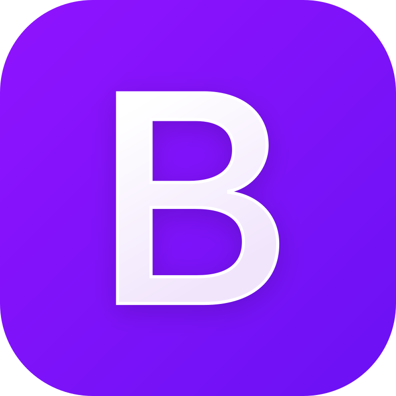

  
# Curso: Desenvolvimento Full Stack
## Mundo 2 - Nível 1 - Missão Prática

## Projeto: Site de Receitas do Carlão

O objetivo deste projeto é a criação de um site estático, *responsivo*, voltado para visualização de receitas culinárias pré-selecionadas.

Trata-se de uma tarefa avaliativa, onde são aplicados conceitos básicos de **HTML**,**CSS** e o *framework* **Bootstrap**, além da organização e clareza do código elaborado.

### Objetivos do Projeto

* Definir a estrutura do site em **HTML** utilizando tags semânticas como (*header*, *main*, *footer*, além de elementos HTML como formulários, tabelas e listas.

* Utilizar folhas de estilo (**CSS**) na formatação das páginas.

* Utilizar o framework **Bootstrap**

* Definir uma fonte de dados estática no próprio **HTML** (dados carregados diretamente no código).

* Utilizar layout *responsivo*.

* Utilizar elementos de navegação.

### Organização do código:

O código está organizado de forma modular, com separação entre a estrutura **HTML** e a estilização em **CSS**.

## Estrutura de Arquivos

        /raiz
        │
        └── receitas/
        │   └── bootstrap-4.1.3-dist/   # Definições do Bootstrap
        │   |    └── css/
        │   |    └── js/
        │   |
        │   └── css                     # Arquivos de estilização (CSS)
        │   |    └── formatos.css
        │   |    └── receitas.css        
        │   │
        │   └── images/                 # Imagens utilizadas no site e README
        │   │   └── Bootstrap.png
        │   │   └── CSS.png
        │   │   └── Github-Dark.png
        │   │   └── HTML.png                                
        │   │   └── logo_receitas_do_carlao.png
        │   │   └── logoEstacio.png
        │   │   └── palito-frango-queijo.jpg
        │   |   └── panceta-pururuca.jpg
        │   |   └── sanduiche-de-camarao-com-abacaxi.jpg
        │   │   └── VisualStudio-Dark.png        
        │   │
        |   └── cadastro.html           # Página de cadastro de usuário
        |   |
        |   └── home.html               # Página inicial do site       
        |   |
        |   └── receitas.html           # Página com lista de receitas
        |
        └── README.md                   # Este arquivo

### Funcionalidades

* **Página Inicial** (*home.html*): Apresenta o *logo* do site com uma pequena descrição e links de navegação.

* **Página de Receitas** (*receitas.html*): Exibe uma lista de receitas com imagens, ingredientes e modo de preparo. Possue *links* para as demais páginas.

* **Página de Cadastro** (*cadastro.html*): Formulário para cadastro de novos usuários.

### Tecnologias Utilizadas
 
:  Para a estruturação das páginas. 
:  Para a estilização e layout das páginas. 
:  Bootstrap 4.1.3 para facilitar o design *responsivo* e garantir que o site seja amigável em dispositivos móveis. 
: Editor de código utilizado no desenvolvimento. 
: Para armazenamento dos códigos e controle de versões. 

### Instruções para Execução

* Clone ou acesse o repositório https://github.com/CarlosCatao/Mundo_2_Nivel_1-MissaoPratica/blob/main/receitas/css/receitas.cssou e faça o download do código.
* Abra os arquivos no seu editor de código (recomendado: Visual Studio Code).
* Abra o arquivo home.html em um navegador ou utilize a extensão "Live Server" no Visual Studio Code para visualizar o site em tempo real.
* Navegue entre as páginas para explorar as receitas e utilizar o formulário de cadastro.

### Como Personalizar

Você pode adicionar novas receitas editando o arquivo receitas.html.
Para alterar o estilo, edite o arquivo CSS apropriado.

### Melhorias Futuras

* Conectar o site a uma base de dados real para armazenar as receitas dinamicamente.
* Implementar um sistema de busca.

### Licença

Este projeto é de cunho didático/avaliativo e é de uso livre para estudo e aprimoramento de habilidades em **HTML**, **CSS** e **Bootstrap**. Sinta-se à vontade para modificá-lo e usá-lo como base para seus próprios projetos.

### Autor

[ Carlos Automare Catão](https://github.com/CarlosCatao)]
